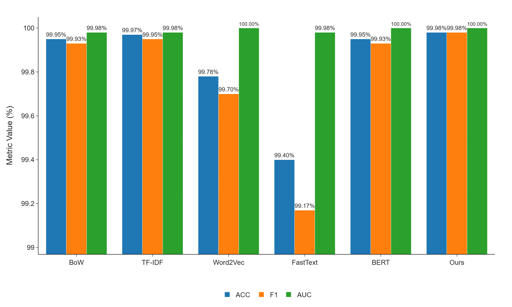
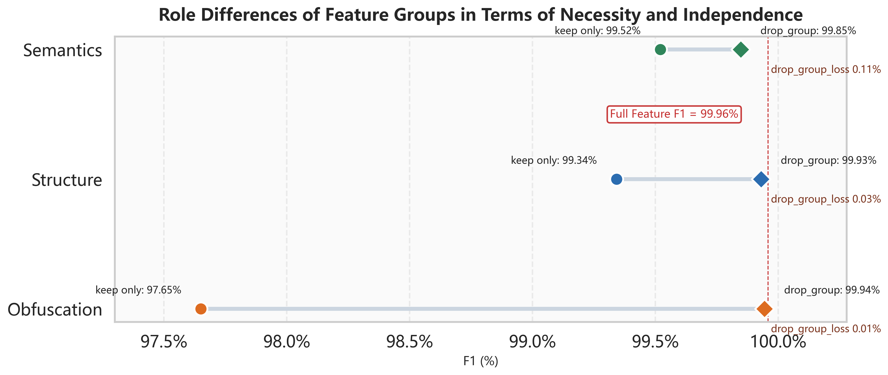
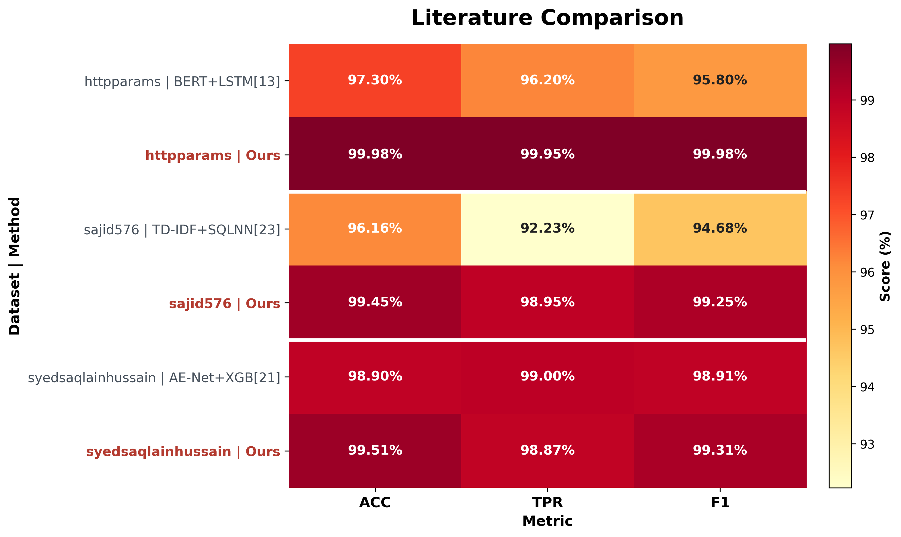

# SQLi-Feature-extraction

SQL injection detection codebase with a feature-based XGBoost method, multiple text-feature baselines, ablation experiments, and cross-dataset evaluation.

[中文](#zh) | [English](#en)

点击下方语言标题展开或收起对应内容。  
Click a language title below to expand or collapse it.

<a id="zh"></a>
<details open>
<summary><strong>中文</strong></summary>

## 项目简介

这是一个面向 SQL 注入检测的实验仓库，包含：
- `ours`：12 维手工特征 + XGBoost 主方法
- `fe/*`：BoW、TF-IDF、Word2Vec、FastText、BERT 基线
- `experiments/ablation`：手工特征消融实验
- `cross_dataset`：跨数据集训练与预测流程

本项目重点是复现实验、方法对比和特征分析，而不是构建一个完整的 Web 防护系统。

## 目录结构

- `ours/`：主方法与模型产物
- `fe/`：各类文本特征基线方法
- `experiments/ablation/`：12 维手工特征消融实验
- `cross_dataset/`：跨数据集评测流程
- `results/`：汇总结果与绘图
- `Data/`：数据集与训练/测试划分

## 数据格式

输入文件支持 CSV 或 JSON，至少包含两列：
- `Query`
- `Label`

`Label` 支持以下形式：
- `0` / `1`
- `normal` / `attack`

## 快速开始

### 1. 安装依赖

```bash
pip install -r requirements.txt
```

### 2. 划分默认数据集

```bash
python ours/split_data.py
```

输出：
- `Data/train_set.csv`
- `Data/test_set.csv`

### 3. 训练主方法

```bash
python ours/train.py
```

主要产物：
- `ours/model/1/scaler_for_numeric.pkl`
- `ours/model/1/numeric_features/model_XGBoost.pkl`
- `ours/model/1/numeric_features/best_threshold.pkl`

### 4. 用主方法预测

```bash
python ours/predict.py
# 或
python ours/predict.py Data/test_set.csv
```

主要输出：
- `ours/model/1/numeric_features/predictions.csv`
- `ours/model/1/numeric_features/` 下的混淆矩阵和 ROC 图
- `results/csv/results_raw.csv` 中追加的结果行

### 5. 运行基线方法

所有基线都遵循同样的调用方式：

```bash
python fe/<method>/train.py
python fe/<method>/predict.py Data/test_set.csv
```

当前支持：
- `bow`
- `tfidf`
- `w2v`
- `fasttext`
- `bert`

示例：

```bash
python fe/bow/train.py
python fe/bow/predict.py Data/test_set.csv
```

### 6. 结果后处理与绘图

```bash
python results/cal.py
python results/plot.py
```

### 7. 消融与跨数据集实验

运行手工特征消融实验：

```bash
python experiments/ablation/run_ablation.py
```

运行跨数据集训练与预测：

```bash
python cross_dataset/train_external.py --dataset all
python cross_dataset/predict_external.py --dataset all
```

## 主要结果

当前 `results/csv/results.csv` 中保存的结果如下：

| Method | ACC | PREC | TPR | F1 | AUC |
| --- | ---: | ---: | ---: | ---: | ---: |
| BoW | 0.9995 | 0.9995 | 0.9991 | 0.9993 | 0.9998 |
| TF-IDF | 0.9997 | 1.0000 | 0.9991 | 0.9995 | 0.9998 |
| Word2Vec | 0.9978 | 0.9963 | 0.9977 | 0.9970 | 1.0000 |
| FastText | 0.9940 | 0.9917 | 0.9917 | 0.9917 | 0.9998 |
| BERT | 0.9995 | 0.9991 | 0.9995 | 0.9993 | 1.0000 |
| Ours | 0.9998 | 1.0000 | 0.9995 | 0.9998 | 1.0000 |


### 主结果对比



### 特征组消融



### 跨数据集结果



## FastText 文件说明

以下文件当前未随仓库上传：

`fe/fasttext/model/1/fasttext.model.wv.vectors_ngrams.npy`

原因：
- 这是 `gensim` FastText 生成的大体积 sidecar 文件
- 文件过大，不适合直接上传到 GitHub

影响：
- 缺少该文件时，`fe/fasttext/predict.py` 不能直接复现当前 FastText 基线
- `fe/fasttext/model/1/fasttext.model` 的加载也依赖这个文件
- 因此仓库中的 FastText 产物不是“开箱即用完整可复现”的状态

本地重生成方式：

```bash
python fe/fasttext/train.py
```

重生成后会重新得到：
- `fasttext.model`
- `fasttext.model.wv.vectors_ngrams.npy`
- `model_XGB.pkl`
- `train_metrics.pkl`

注意：
- `fasttext.model.wv.vectors_ngrams.npy` 不是可选附件
- 如果它缺失，保存下来的 FastText 模型无法正常加载

## 补充说明

- `cross_dataset` 当前只复用 `ours` 方法，并将结果隔离在自己的目录下
- `experiments/ablation` 用于分析 12 维手工特征整体是否有效、哪组更重要、删除单个特征会造成什么影响
- 仓库中已经保留了部分历史结果图和结果表，便于先阅读结论再决定是否重训

</details>

<a id="en"></a>
<details>
<summary><strong>English</strong></summary>

## Overview

This repository is an experimental codebase for SQL injection detection, including:
- `ours`: the main 12-dimensional handcrafted feature pipeline with XGBoost
- `fe/*`: baseline methods using BoW, TF-IDF, Word2Vec, FastText, and BERT
- `experiments/ablation`: ablation study for the handcrafted features
- `cross_dataset`: cross-dataset training and prediction workflows

The focus of this repository is reproducible experimentation, method comparison, and feature analysis rather than a full production-grade web defense system.

## Repository Layout

- `ours/`: main method and model artifacts
- `fe/`: baseline feature-extraction methods
- `experiments/ablation/`: ablation study for the 12 handcrafted features
- `cross_dataset/`: cross-dataset evaluation workflow
- `results/`: aggregated metrics and plots
- `Data/`: datasets and train/test splits

## Data Format

Input files should be CSV or JSON with at least:
- `Query`
- `Label`

Supported `Label` formats:
- `0` / `1`
- `normal` / `attack`

## Quick Start

### 1. Install dependencies

```bash
pip install -r requirements.txt
```

### 2. Split the default dataset

```bash
python ours/split_data.py
```

Outputs:
- `Data/train_set.csv`
- `Data/test_set.csv`

### 3. Train the main method

```bash
python ours/train.py
```

Main artifacts:
- `ours/model/1/scaler_for_numeric.pkl`
- `ours/model/1/numeric_features/model_XGBoost.pkl`
- `ours/model/1/numeric_features/best_threshold.pkl`

### 4. Predict with the main method

```bash
python ours/predict.py
# or
python ours/predict.py Data/test_set.csv
```

Main outputs:
- `ours/model/1/numeric_features/predictions.csv`
- confusion matrices and ROC plots under `ours/model/1/numeric_features/`
- appended metrics in `results/csv/results_raw.csv`

### 5. Run baseline methods

All baselines follow the same pattern:

```bash
python fe/<method>/train.py
python fe/<method>/predict.py Data/test_set.csv
```

Currently supported:
- `bow`
- `tfidf`
- `w2v`
- `fasttext`
- `bert`

Example:

```bash
python fe/bow/train.py
python fe/bow/predict.py Data/test_set.csv
```

### 6. Post-process and plot results

```bash
python results/cal.py
python results/plot.py
```

### 7. feature ablation and cross-dataset experiments

Run the handcrafted-feature ablation study:

```bash
python experiments/ablation/run_ablation.py
```

Run cross-dataset training and prediction:

```bash
python cross_dataset/train_external.py --dataset all
python cross_dataset/predict_external.py --dataset all
```

## Main Results

Current stored summary from `results/csv/results.csv`:

| Method | ACC | PREC | TPR | F1 | AUC |
| --- | ---: | ---: | ---: | ---: | ---: |
| BoW | 0.9995 | 0.9995 | 0.9991 | 0.9993 | 0.9998 |
| TF-IDF | 0.9997 | 1.0000 | 0.9991 | 0.9995 | 0.9998 |
| Word2Vec | 0.9978 | 0.9963 | 0.9977 | 0.9970 | 1.0000 |
| FastText | 0.9940 | 0.9917 | 0.9917 | 0.9917 | 0.9998 |
| BERT | 0.9995 | 0.9991 | 0.9995 | 0.9993 | 1.0000 |
| Ours | 0.9998 | 1.0000 | 0.9995 | 0.9998 | 1.0000 |


### Main benchmark comparison


### Feature-group ablation


### Cross-dataset summary


## FastText Artifact Note

The following file is intentionally not included in the repository:

`fe/fasttext/model/1/fasttext.model.wv.vectors_ngrams.npy`

Reason:
- it is a large sidecar artifact generated by `gensim` FastText
- the file is too large to upload comfortably to GitHub in this repository

Impact:
- without it, `fe/fasttext/predict.py` cannot directly reproduce the stored FastText baseline
- loading `fe/fasttext/model/1/fasttext.model` also depends on this file
- the checked-in FastText artifacts are therefore not fully self-contained

To regenerate it locally:

```bash
python fe/fasttext/train.py
```

This regenerates:
- `fasttext.model`
- `fasttext.model.wv.vectors_ngrams.npy`
- `model_XGB.pkl`
- `train_metrics.pkl`

Important:
- `fasttext.model.wv.vectors_ngrams.npy` is not optional
- if it is missing, the saved FastText model cannot be loaded normally

## Notes

- `cross_dataset` currently reuses only the `ours` pipeline and keeps its outputs isolated
- `experiments/ablation` is meant to analyze whether the 12 handcrafted features work as a whole, which feature groups matter most, and what happens when one feature is removed
- several historical result files and plots are already checked in, so the repository can be inspected before retraining

</details>

## License

This repository is released under the MIT License. See [LICENSE](LICENSE).
