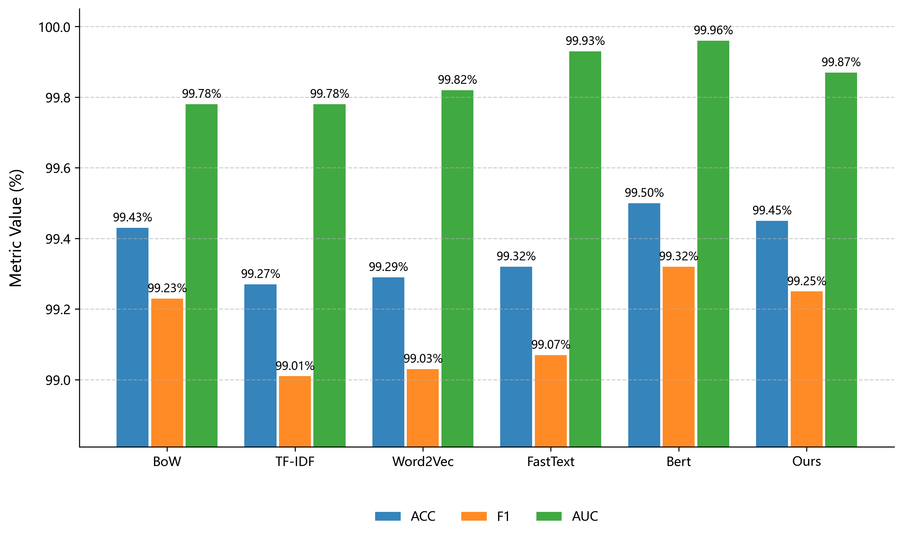
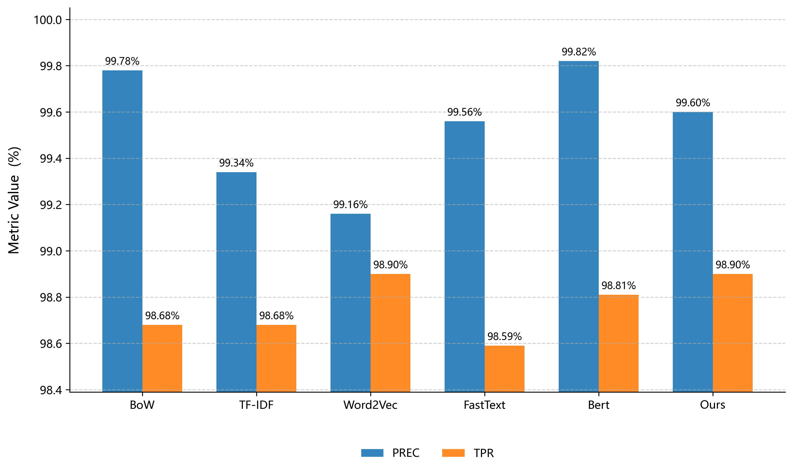
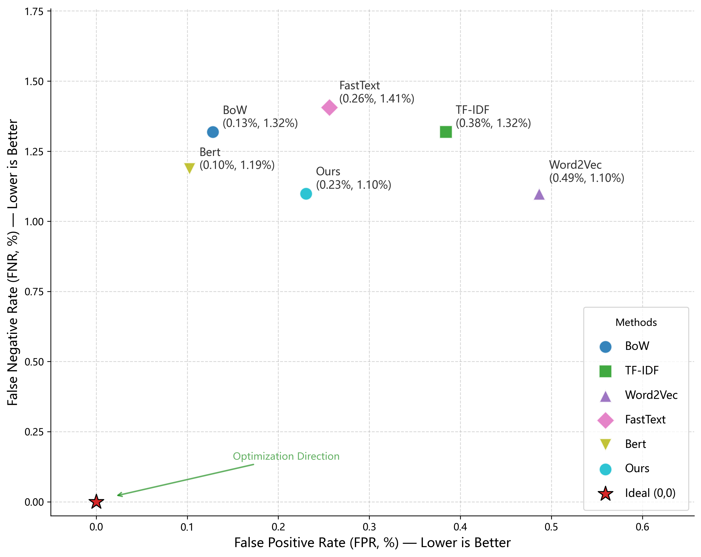

# SQLi Features Extraction

Code and experiments for SQLi extraction.

Run all commands from the repository root so relative paths resolve correctly.

## Requirements

Install dependencies:
- chardet==5.2.0
- numpy
- joblib==1.4.2
- scikit-learn==1.5.2
- scipy==1.10.1
- pandas==2.2.3
- seaborn==0.13.2
- matplotlib==3.10.0
- torch
- transformers
- xgboost==2.1.3
- gensim==4.3.3
- sql_metadata==2.15.0
- sqlglot==26.16.0
- sqlglotrs==0.4.0


```bash
pip install -r requirements.txt
```

## Data layout

Expected input format is CSV or JSON with **Query** and **Label** columns.
`Label` can be `0/1` or `attack/normal` (case-insensitive).

Common files:

- `Data/All_SQL_Dataset.csv` raw full dataset
- `Data/train_set.csv`, `Data/test_set.csv` split outputs
- `Data/feature_extracted_final.csv` generated by `ours/train.py`

## Split data (ours/split_data.py)

Following an ratio of 8:2, we splits `Data/All_SQL_Dataset.csv` into train/test.

```bash
python ours/split_data.py
```

Outputs:

- `Data/train_set.csv`
- `Data/test_set.csv`

## Ours model (feature-based XGBoost)

### Training

```bash
python ours/train.py
```

Flow:

- Prompts for input type (CSV/JSON)
- Default CSV: `Data/train_set.csv`
- Builds `Query_preprocessed` and numeric features
- Writes `Data/feature_extracted_final.csv`

Model artifacts:

- `ours/model/1/numeric_features/model_FSHBoost.pkl`
- `ours/model/1/scaler_for_numeric.pkl`
- `ours/model/1/numeric_features/best_threshold.pkl`

### Prediction / evaluation

```bash
python ours/predict.py
# or
python ours/predict.py Data/test_set.csv
```

Outputs:

- `ours/model/1/numeric_features/predictions.csv`
- Confusion matrices and ROC plots under `ours/model/1/numeric_features/`
- Appends a row to `results/csv/results_raw.csv`

## fe models (text feature pipelines)

Each `fe/*/train.py` prompts for a training file path.  
Each `fe/*/predict.py` accepts an optional path argument (or prompts).

Important: `fe` prediction scripts compute features from **Query** at runtime.
If you pass a `*_featured.csv`, only the `Query` column is used; extra columns are ignored.

### BoW

Train:

```bash
python fe/bow/train.py
```

Artifacts:

- `fe/bow/model/1/model_XGB.pkl`
- `fe/bow/model/1/bow_vectorizer.pkl`

Predict:

```bash
python fe/bow/predict.py Data/test_set.csv
```

Outputs:

- `fe/bow/model/1/bow_roc_curves.png`
- Appends to `results/csv/results_raw.csv`

### TF-IDF

Train:

```bash
python fe/tfidf/train.py
```

Artifacts:

- `fe/tfidf/model/1/model_XGB.pkl`
- `fe/tfidf/model/1/tfidf_vectorizer.pkl`

Predict:

```bash
python fe/tfidf/predict.py Data/test_set.csv
```

Outputs:

- `fe/tfidf/model/1/tfidf_roc_curves.png`
- Appends to `results/csv/results_raw.csv`

### Word2Vec

Train:

```bash
python fe/w2v/train.py
```

Artifacts:

- `fe/w2v/model/1/model_XGB.pkl`
- `fe/w2v/model/1/word2vec.model`

Predict:

```bash
python fe/w2v/predict.py Data/test_set.csv
```

Outputs:

- `fe/w2v/model/1/w2v_roc_curves.png`
- Appends to `results/csv/results_raw.csv`

### FastText

Train:

```bash
python fe/fasttext/train.py
```

Artifacts:

- `fe/fasttext/model/1/model_XGB.pkl`
- `fe/fasttext/model/1/fasttext.model`

Predict:

```bash
python fe/fasttext/predict.py Data/test_set.csv
```

Outputs:

- `fe/fasttext/model/1/fasttext_roc_curves.png`
- Appends to `results/csv/results_raw.csv`

### BERT

Train:

```bash
python fe/bert/train.py
```

Artifacts:

- `fe/bert/model/1/model_XGB.pkl`

Predict:

```bash
python fe/bert/predict.py Data/test_set.csv
```

Outputs:

- `fe/bert/model/1/bert_roc_curves.png`
- Appends to `results/csv/results_raw.csv`

## Results post-processing

### Calculate extra metrics (results/cal.py)

Reads `results/csv/results_raw.csv`, computes FNR/FPR/TNR/MCC/F2, and writes
`results/csv/results_cn.csv`.

```bash
python results/cal.py
```

### Plot metrics (results/plot_cn.py)

Reads `results/csv/results_cn.csv` and writes plots to `results/plots/`.
 
 
 
 
```bash
python results/plot_cn.py
```
